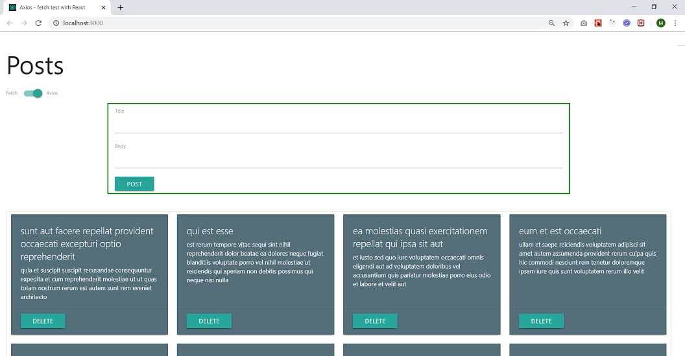

In this React project you can add, update, and delete posts from/to https://jsonplaceholder.typicode.com/ with either axios or fetch. UI is implemented with Materialize CSS.

You can run projects with below commands:

### `yarn start` 
or 
### `npm start`